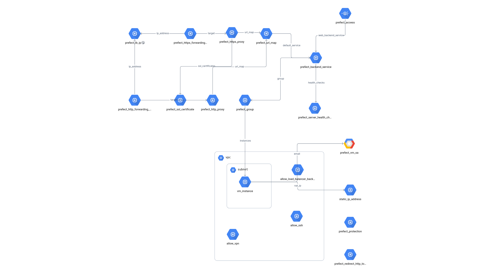

# GCP Prefect Server Infrastructure


Production-grade Terraform infrastructure for deploying a Prefect workflow orchestration server on Google Cloud Platform with optional global load balancing and Identity-Aware Proxy (IAP) authentication.

## Why This Project Exists

After inheriting a click-ops Prefect deployment running on a single VM with no authentication, scattered configs, and undocumented architecture, I rebuilt the infrastructure using Terraform with enterprise-grade security patterns.

This repo demonstrates:
- Migrating legacy infrastructure to IaC without downtime
- Adding authentication to OSS tools that don't have it built-in
- Production-ready patterns for GCP load balancing + IAP
- Modular Terraform architecture for multi-environment deployments

**The Problem:** Prefect OSS has no built-in RBAC. Running it with no auth meant anyone in the organization could access workflow orchestration.

**The Solution:** GCP IAP provides identity-based access control at the load balancer level, no application changes required.

## Key Technical Highlights

- **Infrastructure as Code**: Modular Terraform architecture with reusable components and environment isolation
- **Security-First Design**: IAP authentication, VPC isolation, least-privilege IAM, and firewall rules restricted to GCP service ranges
- **Production-Ready**: Managed SSL certificates, health checks, auto-restart policies, and multi-environment support
- **Cloud-Native**: Leverages GCP-managed services (Load Balancer, Cloud Storage, IAP) for reliability and scalability
- **Feature Flags**: Conditional resource creation via Terraform count and dynamic blocks for flexible deployment patterns

## Overview

This project provisions:

- **Compute Instance**: VM running Prefect server with PostgreSQL backend
- **Networking**: Custom VPC with configurable subnet and firewall rules
- **Load Balancer** (optional): Global HTTP(S) load balancer with managed SSL certificates
- **IAP Authentication** (optional): Zero-trust access control for authorized users
- **Storage**: Integration with Google Cloud Storage for artifacts

## Architecture



The infrastructure consists of:
- **Global Load Balancer** with managed SSL certificates for HTTPS termination
- **IAP Authentication** (optional) providing zero-trust access control
- **Backend Service** routing traffic to the Prefect instance
- **VM Instance** running Prefect Server on port 4200 with PostgreSQL backend
- **VPC networking** with firewall rules restricting access to authorized sources

## Project Structure

```
.
├── modules/
│   └── prefect-vm/          # Reusable Terraform module
│       ├── instance.tf      # VM configuration
│       ├── network.tf       # VPC, subnet, IPs
│       ├── loadbalancer.tf  # Global LB resources
│       ├── firewall.tf      # Security rules
│       ├── iam.tf           # Service accounts & permissions
│       ├── startup.sh.tpl   # VM initialization script
│       ├── vars.tf          # Input variables
│       └── outputs.tf       # Output values
│
└── envs/
    └── staging/             # Staging environment
        ├── main.tf          # Module instantiation
        ├── providers.tf     # Provider configuration
        └── vars.tf          # Environment variables
```

## Prerequisites

### GCP Resources

1. **GCP Project** with enabled APIs:
   - Compute Engine API
   - IAM API
   - Secret Manager API
   - Cloud Storage API

2. **GCS Buckets**:
   - Terraform state storage bucket
   - Prefect artifact storage bucket

3. **Reserved Global IP** (if using load balancer):
   ```bash
   gcloud compute addresses create staging-prefect-lb-ip \
     --global \
     --ip-version IPV4
   ```

4. **IAP OAuth Credentials** (if using IAP):
   - Create OAuth consent screen
   - Create OAuth 2.0 Client ID (Web application)

### Local Requirements

- Terraform >= 1.0
- Google Cloud SDK (`gcloud`)
- Appropriate GCP credentials configured

## Configuration

Create `envs/staging/terraform.tfvars`:

```hcl
# GCP Settings
gcp_project    = "your-project-id"
gcp_region     = "us-central1"
gcp_zone       = "us-central1-a"

# Instance Configuration
instance_name      = "prefect-staging"
machine_type       = "e2-medium"
boot_disk_size_gb  = 60

# Network
subnet_cidr        = "10.0.16.0/20"
vpn_ip_address     = "YOUR_VPN_IP"

# Storage
state_bucket_name  = "your-terraform-state-bucket"
bucket_name        = "your-prefect-storage-bucket"

# Load Balancer (optional)
enable_load_balancer        = true
reserved_prefect_lb_ip_name = "staging-prefect-lb-ip"
prefect_domain              = "prefect.example.com"

# IAP (optional)
enable_iap                 = true
iap_brand                  = "projects/PROJECT_NUMBER/brands/BRAND_ID"
prefect_iap_client_id      = "YOUR_CLIENT_ID"
prefect_iap_client_secret  = "YOUR_CLIENT_SECRET"
authorized_users           = ["user@example.com"]

# Secrets
prefect_postgres_password = "YOUR_DB_PASSWORD"
```

### Feature Flags

- `enable_load_balancer = false`: Direct VM access (HTTP only)
- `enable_load_balancer = true`: Global LB with SSL
- `enable_iap = true`: Adds IAP authentication layer

## Deployment

### Initial Setup

```bash
cd envs/staging
terraform init
```

### Deploy Infrastructure

```bash
terraform plan
terraform apply
```

### Post-Deployment

1. **Wait for VM initialization** (~5-10 minutes):
   ```bash
   gcloud compute ssh {instance_name} --command "sudo tail -f /var/log/startup.log"
   ```

2. **Configure DNS** (if using load balancer):
   - Point your domain to the load balancer IP from `terraform output load_balancer_ip`

3. **Access Prefect UI**:
   - **With LB**: `https://{environment}-{prefect_domain}`
   - **Without LB**: `http://{instance_external_ip}:4200`

## VM Runtime Environment

The VM is configured with:

- **Python Environment**: Python 3.13 with `uv` package manager
- **Prefect Server**: Running on port 4200 (systemd service)
- **Prefect Worker**: Test worker with "Test Flow Pool" (systemd service)
- **Database**: PostgreSQL with dedicated `prefect` database
- **User**: `prefect` system user with sudo access

### Services

View logs:
```bash
# Server logs
gcloud compute ssh {instance_name} --command "sudo journalctl -u prefect-server -f"

# Worker logs
gcloud compute ssh {instance_name} --command "sudo journalctl -u prefect-test-worker -f"
```

## Security

### Network Security

- **SSH Access**: Restricted to IAP range (`35.235.240.0/20`) and VPN IP
- **Prefect UI**: Only accessible via load balancer (if enabled)
- **IAP Protection**: Optional OAuth-based authentication

### Secrets Management

All sensitive values are:
- Marked as `sensitive` in Terraform
- Stored in Secret Manager or passed as variables
- Never committed to version control

### IAM

VM uses service account with minimal required permissions:
- Storage bucket access (if needed for Prefect artifacts)

## Monitoring & Health

### Health Checks

Load balancer health check configuration:
- Endpoint: `/api/health`
- Port: 4200
- Interval: 30 seconds
- Timeout: 10 seconds
- Unhealthy threshold: 3 failures

### Service Resilience

Services automatically restart on failure:
- 10-second restart delay
- Unlimited restart attempts
- Logs to systemd journal

## Outputs

| Output | Description |
|--------|-------------|
| `instance_external_ip` | VM public IP address |
| `instance_internal_ip` | VM private IP address |
| `load_balancer_ip` | Global LB IP (if enabled) |
| `prefect_url` | URL to access Prefect UI |
| `prefect_iap_client_id` | IAP client ID (if enabled) |

## Cleanup

```bash
cd envs/staging
terraform destroy
```

**Warning**: This permanently deletes the VM, boot disk, network resources, and load balancer components.

## Environment Management

To create additional environments (e.g., production):

1. Copy `envs/staging/` to `envs/production/`
2. Update variables in `envs/production/terraform.tfvars`
3. Change `environment` variable to `"production"`
4. Deploy independently

Each environment maintains separate Terraform state and GCP resources.

## Troubleshooting

### VM Not Responding

```bash
gcloud compute ssh {instance_name} --command "sudo tail -100 /var/log/startup.log"
```

### Service Not Starting

```bash
gcloud compute ssh {instance_name} --command "sudo systemctl status prefect-server"
```

### Load Balancer Health Check Failing

1. Verify Prefect is running on port 4200
2. Check firewall rules allow LB health check ranges
3. Verify `/api/health` endpoint responds

### IAP Access Denied

1. Confirm user email in `authorized_users` list
2. Verify IAP client credentials are correct
3. Check IAP brand configuration

## Estimated Monthly Costs

Baseline configuration (us-central1, e2-medium instance):

| Resource | USD/month | EUR/month* |
|----------|-----------|------------|
| Compute (e2-medium, 730 hrs) | $24.27 | €22.50 |
| Load Balancer forwarding rules (2) | $18.00 | €16.70 |
| Load Balancer data processing | $10-50 | €9-46 |
| Cloud Storage (artifacts, minimal) | $1.00 | €0.90 |
| **Total** | **$55-95** | **€51-88** |

*EUR conversion at current rates (~€0.93/$1). GCP bills in USD; actual EUR cost depends on your payment method's exchange rate.

### Cost Optimization Notes:
- **IAP authentication is free** (no additional charge for identity-based access)
- **europe-west regions** (Belgium, Netherlands) have similar pricing to us-central1
- **e2-small** (~$12/€11 per month) works for light workloads
- **Preemptible/Spot VMs** can reduce compute costs by ~60-80%, but require restart tolerance
- **Load balancer** is the largest fixed cost - consider direct VM access for dev/test environments (`enable_load_balancer = false`)

## Module Documentation

For detailed module documentation including all input variables and outputs, see [`vm-with-load-balancer-and-iap-auth/README.md`](vm-with-load-balancer-and-iap-auth/README.md).
